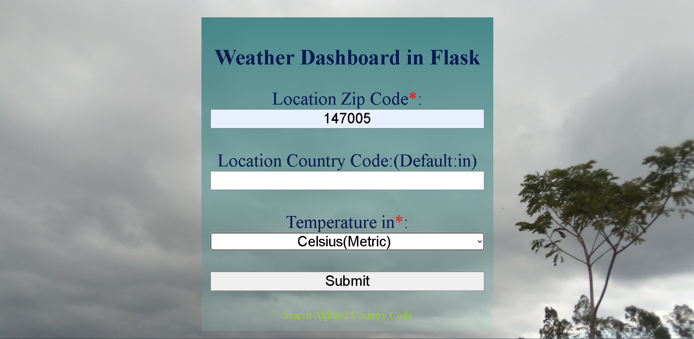
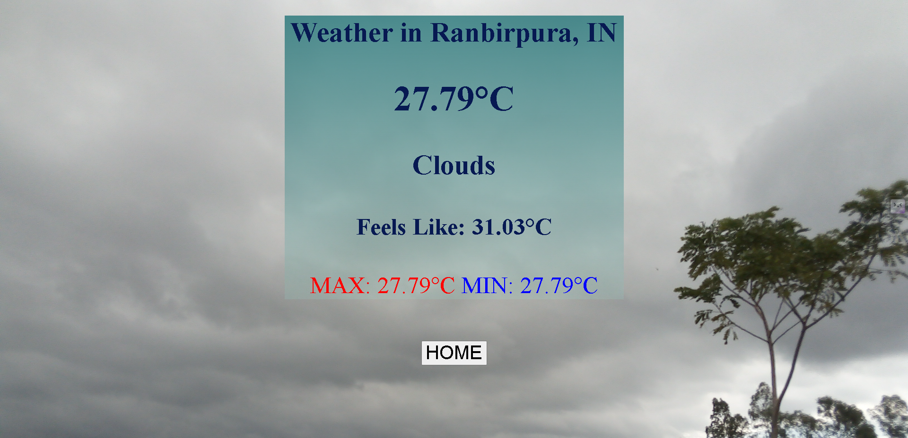

# FLask_Weather
A Weather Forecast Web-App in Flask Framework using Open Weather API

# How to install
In Terminal run following command

```
pip install -r requirements.txt
```

# How to Run
Create an account on OpenWeather and get your api key

Put the key in config.ini
```
open_weather=e24xxxx1
```
like this

Now open terminal in the folder having app.py & enter following command in terminal
```
flask run
```

#Screenshots

## Home Page


## Result Page
